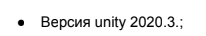

# P.S. В техническом задании была указана версия  Так как не было уточнения по конкретному патчу, было принято решение использовать последнюю стабильную версию 2020.3.48f1.
 
# Unity Game Components Documentation

## Core Game Components

### GameStateHandler
- Управляет основными состояниями игры
- Генерирует события начала игры, завершения уровня и завершения игры
- Основные события: OnGameStarted, OnLevelCompleted, OnGameCompleted

### GameStateVisuals
- Управляет визуальным представлением состояний игры
- Контролирует экран затемнения, кнопку перезапуска и экран загрузки
- Обрабатывает завершение игры и перезапуск

### GameEvents (Static)
- Содержит статические события для коммуникации между компонентами
- События: OnCardClicked, OnLevelCompleted, OnGameCompleted, OnGameRestarted

### LevelInitializer
- Отвечает за инициализацию уровней
- Обрабатывает выбор карточек игроком
- Проверяет правильность выбора карточки
- Переходит к следующему уровню при успешном завершении текущего

### LevelSequence
- Управляет последовательностью уровней
- Предоставляет методы для перехода между уровнями
- Отслеживает текущий уровень
- Проверяет наличие следующего уровня

### GridSpawner
- Создает сетку карточек на основе настроек уровня
- Размещает карточки в правильных позициях
- Управляет очисткой сетки
- Контролирует интерактивность карточек

## Card Components

### CardView
- Визуальное представление карточки
- Отображает иконку
- Управляет поворотом карточки
- Хранит значение карточки

### CardInput
- Обрабатывает пользовательский ввод для карточек
- Управляет интерактивностью карточки
- Генерирует события клика по карточке

### CardAnimator
- Управляет анимациями карточек
- Реализует анимации:
  - Появление карточки (PlaySpawnAnimation)
  - Подпрыгивание при правильном выборе (PlayBounceAnimation)
  - Тряска при неправильном выборе (PlayShakeAnimation)
- Использует DOTween для анимаций

### CardSetGenerator
- Генерирует наборы карточек для уровней
- Следит за уникальностью целевых значений
- Выбирает случайные карточки из доступных наборов

## UI Components

### TaskDisplay
- Отображает текущее задание для игрока
- Обновляет текст задания при смене уровня
- Использует TextMeshPro для отображения текста

### ScreenFader
- Управляет затемнением экрана
- Реализует частичное и полное затемнение
- Использует DOTween для плавных переходов

### RestartButton
- Управляет кнопкой перезапуска игры
- Показывает/скрывает кнопку с анимацией
- Обрабатывает клики по кнопке
- Использует DOTween для анимации прозрачности

### LoadingScreen
- Управляет экраном загрузки
- Показывает анимированный переход между уровнями
- Использует DOTween для анимации прозрачности
- Поддерживает callback после завершения анимации

### UIFader
- Общий компонент для анимации прозрачности UI элементов
- Использует CanvasGroup и DOTween
- Предоставляет методы FadeIn и FadeOut

## Data Components

### GameConfig (ScriptableObject)
- Хранит основные настройки игры:
  - Настройки уровней
  - Наборы карточек (LettersBundle, NumbersBundle)
  - Параметры анимаций (CardBounceScale, CardBounceDuration)
  - Параметры расположения элементов (CellSpacing)
  - Длительность затухания (FadeDuration)

### CardBundleData (ScriptableObject)
- Хранит наборы карточек
- Содержит массив CardData

### CardData (Serializable)
- Структура данных для отдельной карточки
- Хранит:
  - Значение (Value)
  - Иконку (Sprite)
  - Угол поворота (Rotation)

### LevelSequenceData (ScriptableObject)
- Хранит последовательность уровней
- Содержит массив LevelSettings

### LevelSettings (Serializable)
- Настройки отдельного уровня
- Определяет:
  - Количество строк (Rows)
  - Количество столбцов (Columns)
  - Вычисляет общее количество ячеек (CellCount)